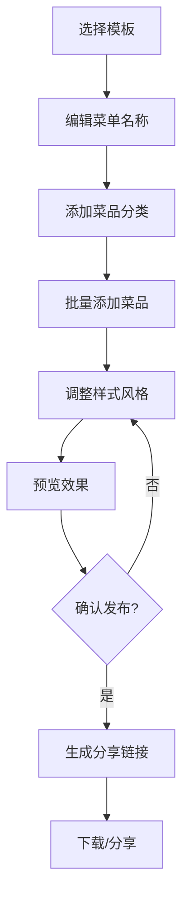
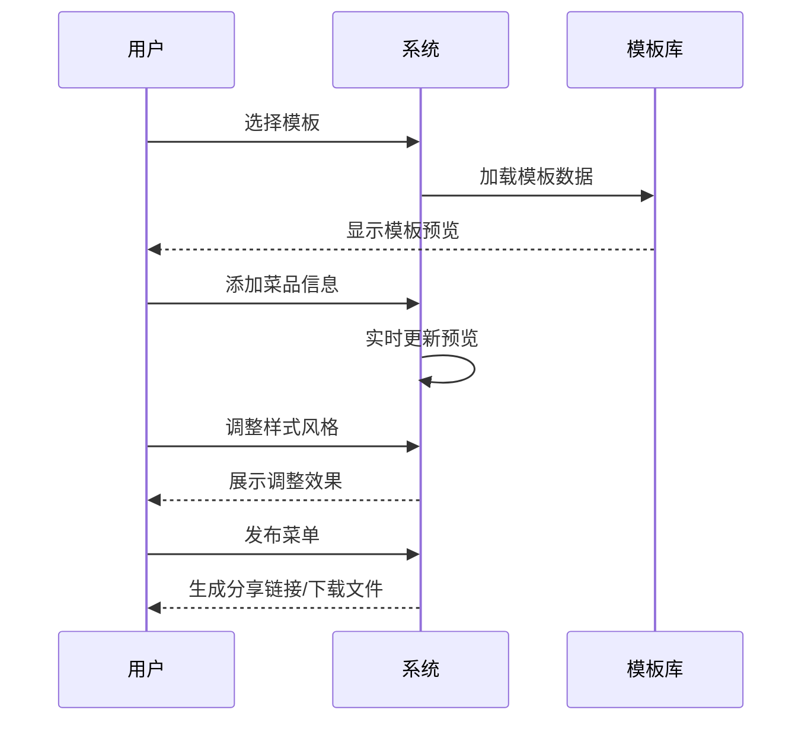

# 餐厅菜单制作小程序 - 产品需求文档

## 1. 产品概述

一款专为中国餐饮行业设计的在线菜单制作工具，帮助餐厅老板和厨师快速创建美观、专业的数字菜单。支持多种模板风格、菜品管理、分类组织和实时预览，让菜单制作变得简单高效。

- 解决传统菜单制作成本高、更新不便、设计不专业的问题
- 提供丰富的模板库和自定义选项，让每家餐厅都能拥有独特的数字菜单
- 目标用户：中小餐厅老板、连锁餐饮管理者、私房菜厨师、外卖商家

---

## 2. 核心功能

### 2.1 用户角色

| 角色 | 注册方式 | 核心权限 |
|------|---------|---------|
| 访客用户 | 无需注册 | 浏览模板、预览菜单 |
| 注册用户 | 手机号/邮箱 | 创建菜单、管理菜品、导出分享 |

### 2.2 功能模块

1. **首页/模板市场**：浏览和选择菜单模板
2. **菜单编辑器**：拖拽式编辑菜单内容
3. **菜品管理**：添加、编辑、删除、排序菜品
4. **分类管理**：创建和管理菜品分类
5. **风格设置**：调整配色、字体、主题
6. **预览与发布**：实时预览、生成链接、下载图片/PDF
7. **我的菜单**：管理已创建的菜单列表

---

## 3. 核心流程

### 3.1 菜单创建流程



### 3.2 用户交互流程



---

## 4. 用户界面设计

### 4.1 设计风格

**整体风格**：现代简约、轻量优雅，融合中式餐饮文化元素

- **主色调**：深棕色 #2C2C2C（沉稳专业）
- **辅助色**：金色 #C9A96E（传统高端）
- **强调色**：番茄红 #E74C3C（食欲刺激）
- **背景色**：米白色 #FAF8F5（温暖舒适）
- **文字色**：深灰 #333333 / 浅灰 #666666

**按钮风格**：
- 主按钮：圆角矩形，金色渐变背景，白色文字
- 次按钮：边框样式，深棕色边框和文字
- 悬停效果：轻微上浮 + 阴影加深

**字体选择**：
- 标题：思源宋体（传统感）或 Noto Sans SC（现代感）
- 正文：思源黑体
- 英文辅助：Playfair Display（装饰性标题）

**布局风格**：
- 左侧固定导航 + 右侧内容区
- 卡片式信息展示
- 网格布局预览区

### 4.2 页面设计详述

#### 4.2.1 首页（模板市场）

| 模块名称 | 交互元素 | 设计规范 |
|---------|---------|---------|
| 顶部导航栏 | Logo、主色调渐变背景、用户头像/登录按钮 | 高度：64px，固定定位 |
| 模板分类导航 | 水平滚动标签栏（中餐/西餐/日料/咖啡厅/快餐/火锅等） | 标签样式：圆角胶囊形，选中态金色填充 |
| 模板卡片网格 | 3列瀑布流展示，每个卡片包含缩略图、模板名称、使用量 | 卡片：阴影效果，悬停时放大1.02倍，显示"立即使用"按钮 |
| 模板筛选器 | 风格筛选（简约/复古/现代/传统）、排序选项 | 下拉菜单样式，圆角边框 |

**页面结构示意**：

```
┌─────────────────────────────────────────────────────┐
│ [Logo]                    模板  我的菜单  [登录/头像]│
├─────────────────────────────────────────────────────┤
│                                                     │
│     🍜 选择适合你的菜单模板                          │
│                                                     │
│  [中餐] [西餐] [日料] [咖啡厅] [快餐] [火锅] [甜品]   │
│                                                     │
├─────────────────────────────────────────────────────┤
│  ┌──────────┐  ┌──────────┐  ┌──────────┐           │
│  │  模板1   │  │  模板2   │  │  模板3   │           │
│  │ [缩略图] │  │ [缩略图] │  │ [缩略图] │           │
│  │          │  │          │  │          │           │
│  │ 传统中餐 │  │ 意式风情 │  │ 极简主义 │           │
│  │ 使用500+ │  │ 使用320+ │  │ 使用200+ │           │
│  └──────────┘  └──────────┘  └──────────┘           │
│                                                     │
│  ┌──────────┐  ┌──────────┐  ┌──────────┐           │
│  │  模板4   │  │  模板5   │  │  模板6   │           │
│  │ [缩略图] │  │ [缩略图] │  │ [缩略图] │           │
│  │          │  │          │  │          │           │
│  │ 复古怀旧 │  │ 活力橙色 │  │ 素雅清新 │           │
│  │ 使用180+ │  │ 使用150+ │  │ 使用120+ │           │
│  └──────────┘  └──────────┘  └──────────┘           │
│                                                     │
└─────────────────────────────────────────────────────┘
```

#### 4.2.2 菜单编辑器页面

| 模块名称 | 交互元素 | 设计规范 |
|---------|---------|---------|
| 左侧工具栏 | 菜品分类树、菜品列表（可拖拽排序） | 宽度：280px，可折叠 |
| 中间编辑区 | 菜单预览画布，支持拖拽调整位置 | 实时渲染，带网格辅助线 |
| 右侧属性面板 | 选中元素的样式属性编辑 | 宽度：320px，可折叠 |
| 顶部工具栏 | 撤销/重做、缩放控制、预览、发布按钮 | 高度：56px |

**核心交互流程**：

1. **添加分类**：点击"+"按钮 → 弹出分类编辑框 → 输入分类名称和图标 → 确认添加
2. **添加菜品**：选择分类 → 点击"添加菜品" → 填写菜品信息（名称、价格、描述、图片）→ 保存
3. **拖拽排序**：鼠标按住菜品项 → 拖动到目标位置 → 显示蓝色放置指示线 → 释放完成排序
4. **编辑菜品**：双击菜品项 → 进入编辑模式 → 修改信息 → 点击其他区域保存
5. **批量操作**：勾选多个菜品 → 显示批量操作栏（移动分类、删除、置顶）

**页面结构示意**：

```
┌────────────────────────────────────────────────────────────────┐
│ [← 返回] 我的菜单 - 川香小馆          [撤销][重做] [预览] [发布] │
├──────────┬─────────────────────────────┬─────────────────────┤
│          │                             │     样式设置        │
│ 菜品分类  │                             ├─────────────────────┤
│ ┌──────┐ │                             │  背景设置           │
│ │凉菜类 │ │    ┌───────────────────┐  │  ○ 米白色           │
│ │  ↓   │ │    │                   │  │  ○ 复古纸张          │
│ │ ├拍黄瓜│    │    菜单预览区        │  │  ○ 实木纹理          │
│ │ ├拌木耳│    │                   │  │                     │
│ │ └盐焗鸡│    │   ┌─────────────┐   │  字体设置            │
│ ├──────┐ │    │   │ 菜品1  ¥28 │   │  字体：思源宋体      │
│ │热菜类 │ │    │   │ 菜品2  ¥36 │   │  大小：16px          │
│ │  ↓   │ │    │   │ 菜品3  ¥42 │   │  颜色：#333333       │
│ │ ├水煮鱼│    │   └─────────────┘   │                     │
│ │ ├麻婆豆腐│    │                   │  间距设置            │
│ └──────┘ │    └───────────────────┘  │  分类间距：24px     │
│          │                             │  菜品间距：12px     │
│ [+添加分类]│                            │                     │
├──────────┴─────────────────────────────┴─────────────────────┤
│                    缩放：[-][100%][+]  拖拽添加菜品或分类      │
└────────────────────────────────────────────────────────────────┘
```

#### 4.2.3 预览页面

| 模块名称 | 交互元素 | 设计规范 |
|---------|---------|---------|
| 菜单展示区 | 全屏展示菜单效果，支持手机/平板/电脑三种预览模式 | 居中显示，带设备边框装饰 |
| 操作按钮 | 分享链接、下载图片、下载PDF、返回编辑 | 底部固定悬浮按钮 |
| 二维码展示 | 点击分享后显示小程序码和链接 | 弹窗形式，带复制链接按钮 |

**预览模式切换**：

```
┌────────────────────────────────────────┐
│     手机预览    平板预览    电脑预览     │
│        ●           ○           ○        │
├────────────────────────────────────────┤
│  ┌──────────────────────────────────┐  │
│  │                                  │  │
│  │     ┌────────────────────┐       │  │
│  │     │                    │       │  │
│  │     │   真实菜单预览     │       │  │
│  │     │                    │       │  │
│  │     │                    │       │  │
│  │     └────────────────────┘       │  │
│  │                                  │  │
│  └──────────────────────────────────┘  │
│                                        │
│  [复制链接]  [下载图片]  [下载PDF]      │
└────────────────────────────────────────┘
```

#### 4.2.4 我的菜单页面

| 模块名称 | 交互元素 | 设计规范 |
|---------|---------|---------|
| 菜单卡片列表 | 显示已创建的菜单卡片，包含缩略图、名称、更新时间、访问量 | 卡片布局，2列网格 |
| 操作按钮 | 编辑、复制链接、删除、查看数据 | 悬停显示操作栏 |
| 空状态提示 | 无菜单时显示引导创建入口 | 大插图 + CTA按钮 |

**页面结构示意**：

```
┌──────────────────────────────────────────────────────┐
│  我的菜单                              [+ 创建新菜单]│
├──────────────────────────────────────────────────────┤
│                                                      │
│  ┌──────────────────┐  ┌──────────────────┐         │
│  │ [菜单缩略图]     │  │ [菜单缩略图]     │         │
│  │                  │  │                  │         │
│  │ 川香小馆菜单     │  │ 意式咖啡厅       │         │
│  │ 更新于 2小时前   │  │ 更新于 昨天      │         │
│  │ 👁 1.2k 浏览     │  │ 👁 856 浏览      │         │
│  │                  │  │                  │         │
│  │ [编辑] [链接] [删除]│  │ [编辑] [链接] [删除]│         │
│  └──────────────────┘  └──────────────────┘         │
│                                                      │
│  ┌──────────────────┐  ┌──────────────────┐         │
│  │ [菜单缩略图]     │  │ [菜单缩略图]     │         │
│  │                  │  │                  │         │
│  │ 粤式点心铺       │  │ 日式居酒屋       │         │
│  │ 更新于 3天前     │  │ 更新于 1周前      │         │
│  │ 👁 523 浏览       │  │ 👁 412 浏览      │         │
│  │                  │  │                  │         │
│  │ [编辑] [链接] [删除]│  │ [编辑] [链接] [删除]│         │
│  └──────────────────┘  └──────────────────┘         │
│                                                      │
└──────────────────────────────────────────────────────┘
```

---

### 4.3 响应式设计

**断点设置**：
- 桌面端：≥1200px（3列模板展示）
- 平板端：768px - 1199px（2列模板展示，工具栏可折叠）
- 移动端：<768px（单列展示，底部导航切换页面）

**移动端适配**：
- 编辑器模式改为标签页切换（分类/菜品/样式）
- 预览功能全屏展示，支持手势缩放
- 长按菜品项触发操作菜单

---

### 4.4 微交互动效设计

#### 4.4.1 过渡动画

| 场景 | 动画效果 | 时长 |
|------|---------|------|
| 页面切换 | 淡入淡出 + 轻微上移 | 300ms |
| 卡片悬停 | 轻微放大 + 阴影加深 | 200ms |
| 按钮点击 | 轻微下沉 + 颜色变深 | 100ms |
| 分类展开 | 高度平滑展开 + 内容渐显 | 250ms |

#### 4.4.2 加载状态

- 模板加载：骨架屏 + 渐显动画
- 菜品保存：按钮显示加载动画 + 成功提示toast
- 图片上传：进度条 + 预览缩略图

#### 4.4.3 反馈机制

- 操作成功：绿色toast提示 "保存成功"
- 操作失败：红色toast提示 "保存失败，请重试"
- 删除确认：模态框确认 "确定删除此菜品？"
- 未保存离开：提示 "您有未保存的更改，是否离开？"

---

## 5. 交互稿评审要点

### 5.1 功能完整性检查

- ✅ 是否覆盖了菜单制作的核心流程（创建→编辑→发布）
- ✅ 是否支持菜品和分类的增删改查
- ✅ 是否提供实时预览功能
- ✅ 是否支持多种分享和导出方式

### 5.2 用户体验检查

- ✅ 关键操作路径是否简短（≤3步）
- ✅ 是否提供清晰的视觉反馈
- ✅ 错误提示是否友好易懂
- ✅ 是否考虑了新手用户的引导

### 5.3 视觉设计检查

- ✅ 风格是否统一协调
- ✅ 色彩搭配是否专业舒适
- ✅ 排版是否清晰易读
- ✅ 是否符合餐饮行业的调性

---

## 6. 版本规划

**MVP版本（V1.0）**：
- 基础模板选择
- 菜单编辑（分类+菜品）
- 基础样式调整
- 预览和分享链接

**迭代版本（V1.1+）**：
- 更多专业模板
- 图片上传和裁剪
- PDF导出
- 数据统计
- 模板收藏和历史版本

---

**文档版本**：V1.0  
**创建日期**：2026-05-27  
**作者**：AI Assistant
