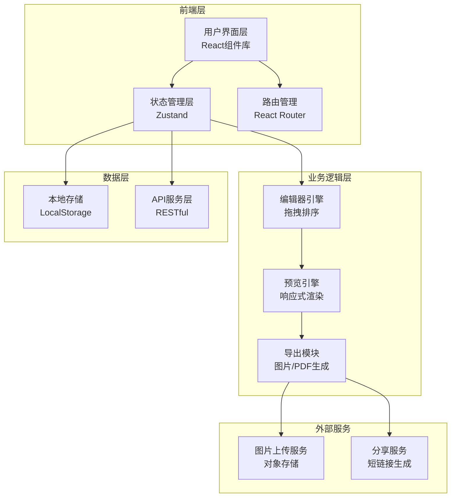
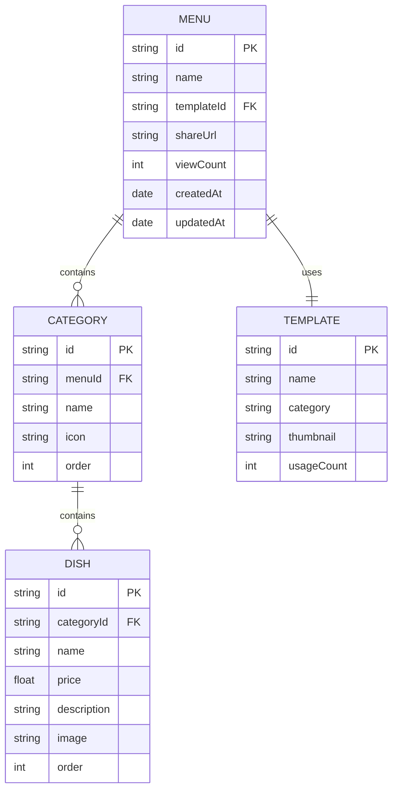

# 餐厅菜单制作小程序 - 技术架构文档

## 1. 架构设计



---

## 2. 技术选型

### 2.1 前端技术栈

- **核心框架**：React@18 + TypeScript
- **构建工具**：Vite
- **样式方案**：TailwindCSS + CSS Variables
- **状态管理**：Zustand（轻量级状态管理）
- **路由管理**：React Router DOM v6
- **拖拽库**：@dnd-kit（现代拖拽排序库）
- **PDF生成**：html2canvas + jsPDF
- **图标库**：Lucide React
- **动画库**：Framer Motion（复杂交互动画）

### 2.2 数据存储

- **本地存储**：LocalStorage（菜单数据、用户偏好）
- **图片存储**：Base64编码（初始版本）或云存储（后期）
- **无后端设计**：MVP版本采用纯前端方案

---

## 3. 路由定义

| 路由路径 | 页面名称 | 功能描述 |
|---------|---------|---------|
| `/` | 首页/模板市场 | 浏览和选择菜单模板 |
| `/editor/:templateId` | 菜单编辑器 | 编辑菜单内容和样式 |
| `/preview/:menuId` | 菜单预览 | 全屏预览菜单效果 |
| `/my-menus` | 我的菜单 | 管理已创建的菜单列表 |
| `/shared/:shareId` | 分享页面 | 公开分享的菜单浏览页 |

---

## 4. 数据模型设计

### 4.1 菜单数据模型

```typescript
interface Menu {
  id: string;
  name: string;
  templateId: string;
  style: MenuStyle;
  categories: Category[];
  createdAt: Date;
  updatedAt: Date;
  shareUrl?: string;
  viewCount: number;
}

interface Category {
  id: string;
  name: string;
  icon?: string;
  dishes: Dish[];
  order: number;
}

interface Dish {
  id: string;
  name: string;
  price: number;
  description?: string;
  image?: string;
  order: number;
}

interface MenuStyle {
  backgroundColor: string;
  backgroundType: 'solid' | 'gradient' | 'image';
  fontFamily: string;
  fontSize: number;
  textColor: string;
  spacing: {
    categoryGap: number;
    dishGap: number;
  };
}

interface Template {
  id: string;
  name: string;
  category: string;
  thumbnail: string;
  style: MenuStyle;
  usageCount: number;
}
```

### 4.2 ER关系图



---

## 5. 核心模块设计

### 5.1 编辑器模块

**职责**：处理菜单的创建、编辑、排序等核心操作

**关键功能**：
- 分类的增删改查
- 菜品的增删改查
- 拖拽排序（分类顺序、菜品顺序）
- 跨分类移动菜品
- 撤销/重做功能
- 自动保存机制

**组件结构**：
```
EditorPage
├── EditorToolbar
├── EditorLayout
│   ├── LeftPanel (分类树 + 菜品列表)
│   ├── Canvas (菜单预览画布)
│   └── RightPanel (样式设置面板)
└── EditorFooter
```

### 5.2 预览引擎模块

**职责**：实时渲染菜单预览，支持多种设备尺寸

**关键功能**：
- 响应式预览（手机/平板/电脑）
- 样式实时更新
- 打印样式适配
- 性能优化（虚拟列表）

### 5.3 导出模块

**职责**：生成可分享和打印的菜单格式

**导出格式**：
- **图片导出**：PNG/JPEG（用于社交媒体分享）
- **PDF导出**：A4/电子屏幕尺寸（用于打印和张贴）
- **分享链接**：生成唯一短链接

**技术实现**：
1. 使用 `html2canvas` 将DOM转换为Canvas
2. 使用 `jsPDF` 将Canvas转换为PDF
3. 使用草料二维码API生成分享二维码

---

## 6. 状态管理设计

### 6.1 全局状态 (Zustand Store)

```typescript
interface MenuStore {
  // 当前编辑的菜单
  currentMenu: Menu | null;
  
  // 操作历史（撤销/重做）
  history: Menu[];
  historyIndex: number;
  
  // UI状态
  selectedCategoryId: string | null;
  selectedDishId: string | null;
  isPreviewMode: boolean;
  
  // Actions
  setMenu: (menu: Menu) => void;
  updateCategory: (id: string, data: Partial<Category>) => void;
  updateDish: (id: string, data: Partial<Dish>) => void;
  addCategory: (category: Category) => void;
  deleteCategory: (id: string) => void;
  addDish: (categoryId: string, dish: Dish) => void;
  deleteDish: (categoryId: string, dishId: string) => void;
  moveDish: (fromCategoryId: string, toCategoryId: string, dishId: string) => void;
  reorderCategory: (fromIndex: number, toIndex: number) => void;
  reorderDish: (categoryId: string, fromIndex: number, toIndex: number) => void;
  updateStyle: (style: Partial<MenuStyle>) => void;
  
  // 历史记录
  undo: () => void;
  redo: () => void;
  saveToHistory: () => void;
}
```

### 6.2 本地存储同步

- 使用 `zustand/middleware` 的 `persist` 中间件
- 自动保存到LocalStorage
- 页面刷新后恢复状态

---

## 7. 组件库设计

### 7.1 基础组件

| 组件名 | 用途 | 变体 |
|--------|------|------|
| Button | 按钮 | primary, secondary, ghost, danger |
| Input | 输入框 | text, number, textarea |
| Card | 卡片容器 | default, hover, selected |
| Modal | 模态框 | confirm, form, viewer |
| Toast | 提示消息 | success, error, warning, info |
| Dropdown | 下拉菜单 | default, icon-only |
| Tabs | 标签页 | horizontal, vertical |
| Tooltip | 工具提示 | top, bottom, left, right |

### 7.2 业务组件

| 组件名 | 用途 |
|--------|------|
| TemplateCard | 模板卡片组件 |
| CategoryTree | 分类树形列表 |
| DishItem | 菜品列表项 |
| StylePanel | 样式设置面板 |
| PreviewCanvas | 菜单预览画布 |
| ExportModal | 导出选项弹窗 |
| ShareModal | 分享信息弹窗 |

---

## 8. 性能优化策略

### 8.1 代码分割
- 使用 React.lazy 进行路由级代码分割
- 编辑器页面独立打包

### 8.2 渲染优化
- 使用 React.memo 减少不必要的重渲染
- 虚拟列表技术处理长列表
- 预览区使用 requestAnimationFrame 防抖

### 8.3 资源优化
- 图片懒加载
- 字体文件预加载
- CSS资源内联（首屏关键样式）

### 8.4 缓存策略
- 模板数据本地缓存
- 用户操作历史本地存储
- 草稿自动保存

---

## 9. 目录结构

```
menu-maker/
├── public/
│   ├── templates/          # 模板静态资源
│   └── images/             # 公共图片资源
├── src/
│   ├── components/         # React组件
│   │   ├── common/        # 通用基础组件
│   │   ├── editor/        # 编辑器相关组件
│   │   ├── preview/       # 预览相关组件
│   │   └── templates/     # 模板展示组件
│   ├── pages/             # 页面组件
│   ├── stores/            # Zustand状态管理
│   ├── hooks/             # 自定义Hooks
│   ├── utils/            # 工具函数
│   ├── types/            # TypeScript类型定义
│   ├── data/             # 静态数据和模板配置
│   ├── styles/           # 全局样式
│   ├── App.tsx
│   └── main.tsx
├── index.html
├── package.json
├── tsconfig.json
├── vite.config.ts
└── tailwind.config.js
```

---

## 10. 开发规范

### 10.1 命名规范
- 组件文件：PascalCase（如 MenuEditor.tsx）
- 工具函数：camelCase（如 useMenuStore.ts）
- 类型定义：PascalCase 接口名

### 10.2 代码风格
- 使用 TypeScript 严格模式
- 使用 ESLint + Prettier
- 组件使用函数式写法 + Hooks
- 样式使用 TailwindCSS 工具类

### 10.3 Git提交规范
- feat: 新功能
- fix: 修复bug
- docs: 文档更新
- style: 代码格式
- refactor: 重构
- test: 测试相关

---

**文档版本**：V1.0  
**创建日期**：2026-05-27  
**作者**：AI Assistant
